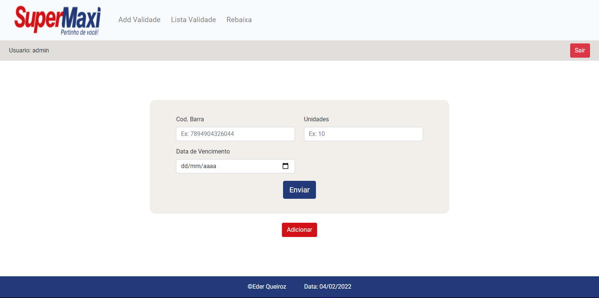

<h1 align="center">Controle de Validade 📅</h1>
<h3 align="center">Um app para fazer o controle de validade dos produtos de supermercado.</h3> 

 

Esse é um protótipo simples, para solucionar o problema de controle de validade nos supermercados, onde voê pode cadastrar e alterar produtos, além de, 
poder consultar os produtos existentes e outras ferramentas que vão te auxiliar nesse processo.

 

## 📶 Acesse o site
https://ederqueiroz.000webhostapp.com/

## 📬 Licença
Este software foi criado apenas para fins de estudo. Sinta-se à vontade para experimentá-lo.
